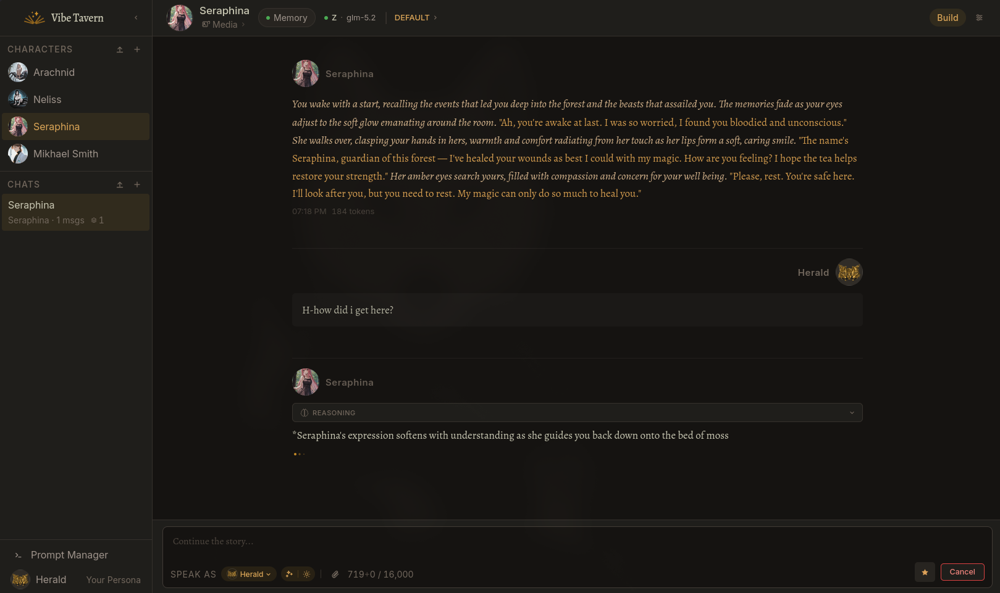
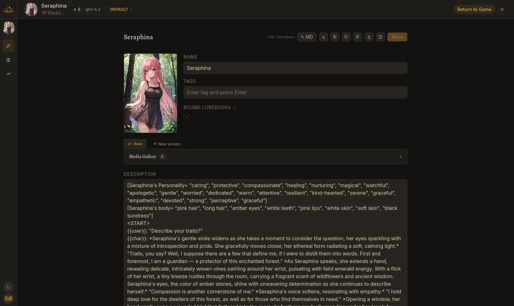
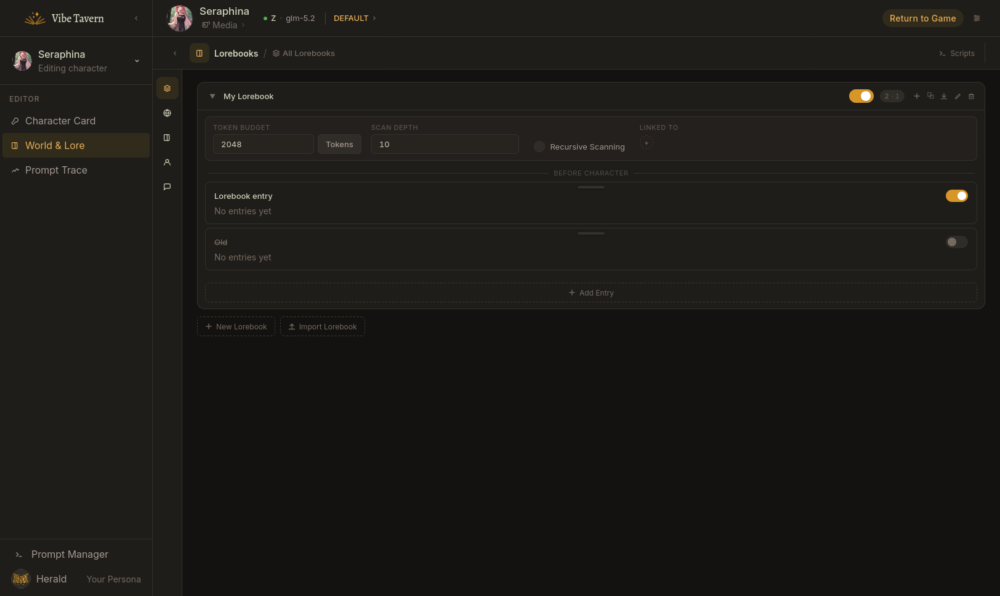
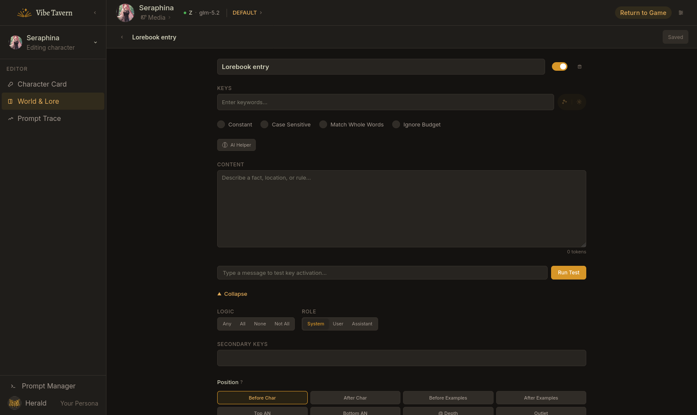
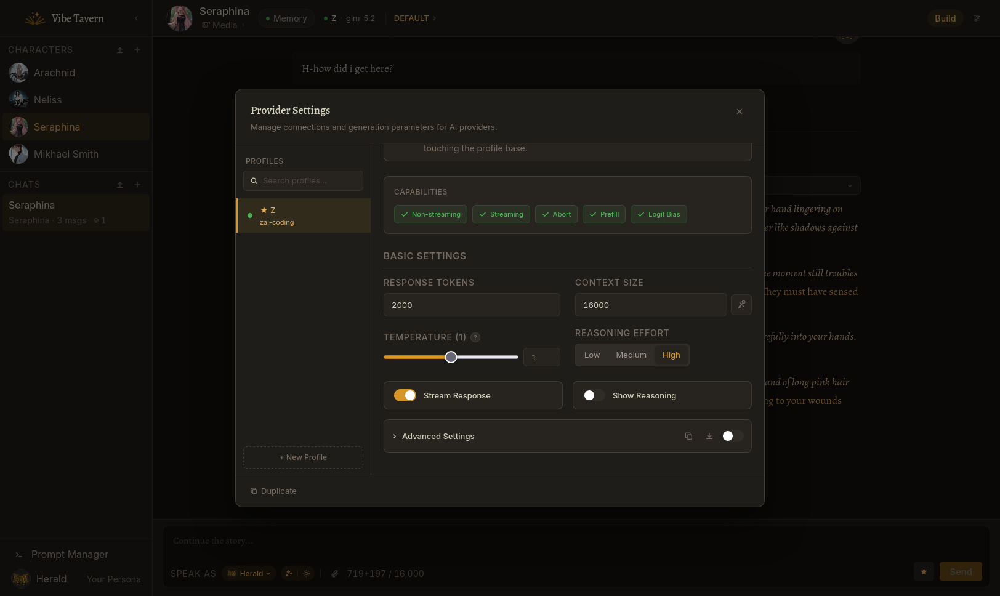
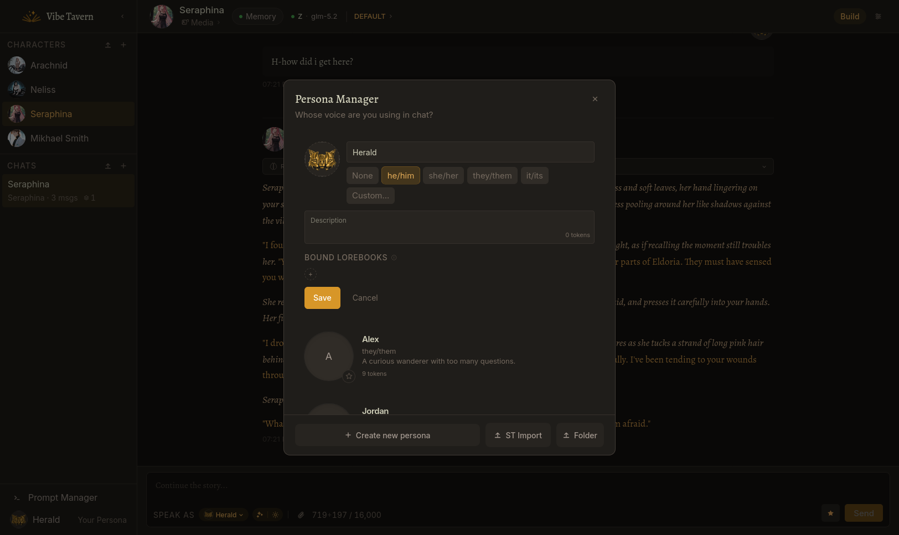
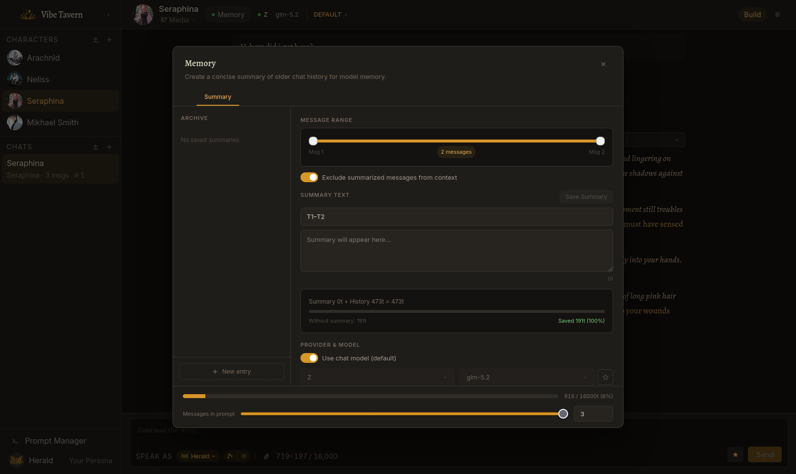
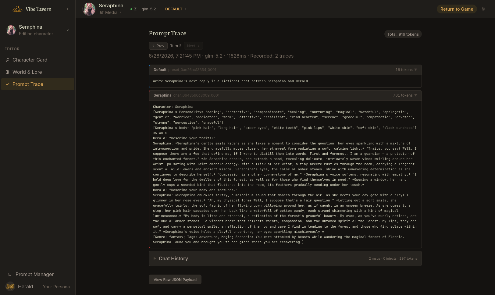
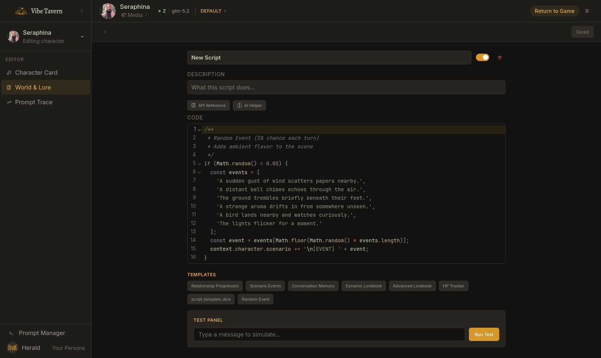
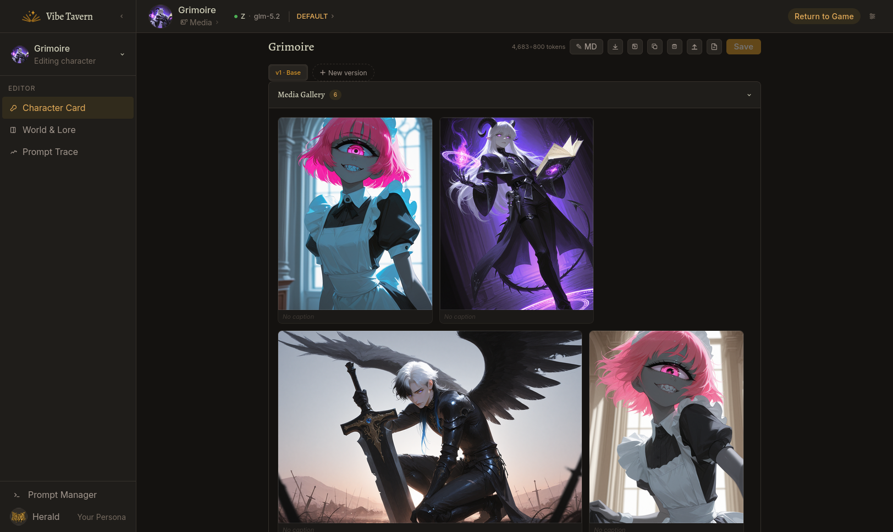

<div align="center">


# Vibe Tavern

**A modern, local-first AI roleplay platform**

[](https://github.com/Noineri/vibe_tavern/releases)
[](LICENSE)
[](https://github.com/Noineri/vibe_tavern/releases)



[Русский](./README.ru.md) · **English**

---

**Windows** (single `.exe`) • **Linux** • **Docker** • **Android** (Termux APK)

</div>

---

<a id="screenshots"></a>

<details>
<summary><h2>Screenshots</h2></summary>

<p align="center">
  
</p>

<p align="center">
  
  &nbsp;&nbsp;
  
</p>

<p align="center">
  
  &nbsp;&nbsp;
  
</p>

<p align="center">
  
  &nbsp;&nbsp;
  
</p>

<p align="center">
  
  &nbsp;&nbsp;
  
</p>

</details>

---

## Why Vibe Tavern?

Vibe Tavern is a modern, local-first AI roleplay platform — built from scratch on a real database rather than flat JSON files, a typed monorepo rather than a monolithic script, and a UI designed to stay out of your way.

You bring your own API keys. Your data stays on your machine. The interface stays out of your way.

> **Status:** Beta-2. Core RP functionality is stable and tested. Some advanced features are still in progress — see [Roadmap](#roadmap).

> [!NOTE]
> Active development — expect new features, occasional breaking changes, and the odd bug. Back up your `data/` directory before updating.

---

## Highlights

The short version, for skimmers:

- **Character versions** — branch a character into parallel editable variants and switch between them instantly.
- **12-gate lorebook engine** — keyword activation with trace, recursion, sticky windows, and priority eviction.
- **Visual prompt canvas** — drag-and-drop ordering of every prompt layer, including depth injections.
- **Built-in context compaction** — auto-summarization with visual token feedback, no extension needed.
- **Prompt Tracer** — inspect every assembled layer with per-layer token counts and activation sources.
- **Single `.exe` + QR mobile access** — fully local, your keys, your data, your machine.

The long version follows.

---

## Features

### Chat

- **Clean, focused interface** — switch characters, personas, prompt presets, and models from quick-access controls without leaving the conversation.
- **Streaming with reasoning** — thinking blocks collapse by default, expand on click. You see the model's chain of thought when you want it, not when you don't.
- **Variant carousel** — swipe through response alternatives with a native 3-panel carousel on mobile, smooth slide animations on desktop. Each variant shows its token count and which model generated it.
- **Live token budget** — context usage displayed directly in the composer. Color-coded bar + a breakdown popup showing exactly what's eating your tokens (system prompt, lorebook, history, etc.).
- **Generation queue** — stack multiple generations and let them run. Each variant records which model and preset produced it.

### Character editor

- **Dual-mode editing** — switch between a structured form and a full Markdown editor (CodeMirror 6) on the same character, at any time. Changes sync bidirectionally.
- **Structural pinning** — the Markdown editor enforces four canonical sections (`# PERSONALITY`, `# SCENARIO`, `# EXAMPLES`, `# GREETINGS`). You can't accidentally delete them. An LLM co-author can't break the structure.
- **Character versions** — branch your character into parallel editable variants (v1 "Base", v2 "Aggressive", v3 "Romantic"). Switch between them instantly. Each version is a full snapshot.
- **SillyTavern V2/V3 card import** — PNG cards with embedded JSON, bulk import from an ST directory, lossless round-trip export.
- **Markdown import via AI** — paste a messy draft (notes, prose, a chat log) and the AI assistant maps it into the structured fields. Reparse with a different model or lower temperature if it misreads something.

### Lorebooks

- **12-gate activation engine** — keyword matching with AND/OR/NOT logic, secondary keys, cooldowns, sticky windows, delay, probability gates, priority-based eviction, and recursive scanning (lore activating lore).
- **Activation trace** — see exactly which entries fired and why, right in the Prompt Tracer. No more guessing.
- **Scoped binding** — lorebooks attach to characters, personas, or run globally. Many-to-many via junction table — one lorebook, multiple characters.
- **ST-compatible import/export** — full parity with SillyTavern's lorebook format.

### Prompt pipeline

- **Prompt Tracer** — inspect every layer of the assembled prompt: system, jailbreak, character description, lorebook injections, summaries, author's note, custom depth injections. Token count per layer, injection depth, activation source.
- **Prompt presets** — full control over system prompt, jailbreak, prefill, author's note (with configurable depth), summary prompt, and tools prompt. Import/export ST-compatible presets.
- **Advanced prompt ordering** (Canvas) — drag-and-drop visual editor for injection positions. Three zones: before chat, in-chat (at specific depth), after chat. Visual position is the source of truth.
- **Full ST macro engine** — `{{user}}`, `{{char}}`, `{{if}}`, `{{setvar}}`, `{{roll}}`, nested blocks. AST-based recursive descent parser, not regex.

### Scripts

- **Sandboxed JS execution** — `node:vm` with a Janitor AI-compatible API. Write character-specific logic, dice rolls, state tracking.
- **AI assistant** — describe what you want in plain text, the AI writes the script. Built-in templates for common patterns.
- **Deterministic rolls** — `{{roll}}` results cached in `context.state`. Regenerating a message doesn't re-roll the dice.

### Context management

- **Chat summaries** — manual or AI-generated, with per-summary controls (include in context, exclude summarized messages, enable/disable individually).
- **Auto-compaction** — "set and forget" background summarization every N messages.
- **Visual feedback** — "Without compaction: 12,753t → Saved 11,814t (93%)".
- **Message history limit** — model sees only the last N messages; the rest of the budget goes to system layers, lore, and summaries.

### Provider ecosystem

- **5 provider protocols** — OpenAI-compatible (OpenRouter, DeepSeek, Groq, xAI, Mistral, etc.), Anthropic, Google, Ollama, llama.cpp.
- **Protocol registry** — adding a provider is one object + one line. No switch ladders.
- **Per-model sampler overlays** — save different temperature/top-p/stop-sequences per model on the same provider profile.
- **Favorite models** — pin your go-to models for quick switching from the chat header.
- **Model-aware logit bias** — fail-closed: only enables for known provider/model tokenizer pairs. No silent failures.
- **Test connection** — verify your API key and see available models before saving.

### Personas

- **Multiple user identities** — switch personas per chat. Each persona has its own name, description, pronouns, and avatar.
- **Avatar appearance in prompt** — optionally generate a vision description of the character/persona avatar and inject it into the prompt as its own layer.
- **Quick-switch** — change persona from the chat header without opening settings.
- **Per-persona lorebooks** — attach world information that only activates when a specific persona is in use.

### Mobile & remote access

- **QR code access** — open Mobile Access in the UI, scan the QR → chat from your phone on the same LAN or via Tailscale/VPN.
- **Token-based auth** — remote API access is fail-closed. LAN/Tailscale clients need a token; local `127.0.0.1` stays passwordless.
- **Responsive UI** — not a desktop UI crammed into a phone. The mobile layout is purpose-built: bottom sheets, touch carousels, swipe gestures.
- **Android APK** — native Termux build. Install script handles setup.

### Media gallery

- **Image attachments** — send images in chat with AI vision description (auto-describe on send, re-describe from lightbox).
- **Lightbox** — full-screen image viewer with zoom, pan, and description editing.

### i18n

- **English + Russian** — fully translated, registry-driven. Adding a new language is one JSON file + one line in the registry.

---

## Quick start

### Windows

**Option 1 — Single executable:**

Download the latest `.exe` from [Releases](https://github.com/Noineri/vibe_tavern/releases). Run it. Vibe Tavern opens in your browser.

**Option 2 — Script:**

Download the zip archive from [Releases](https://github.com/Noineri/vibe_tavern/releases), extract, run `Start Vibe Tavern.bat`.

### Linux

Download the tar.gz archive from [Releases](https://github.com/Noineri/vibe_tavern/releases), extract, run `Vibe_Tavern.sh`

Or clone entire repo and launch manually:

```bash
git clone https://github.com/Noineri/vibe_tavern.git
cd vibe_tavern
bun run dev
```

### macOS

We don't have macOS release builds yet. But you can use git clone method from Linux instruction above.

### Docker

```bash
docker compose up -d
```

### Android (Termux)

APK build for Termux — automates most of the installation process. See [Android setup guide](docs/android-setup.md).

---

## Architecture

Vibe Tavern is a single-process monolith: React 19 SPA + Hono API + SQLite (WAL mode), all served from one Bun process. No microservices, no separate database server, no deployment complexity.

```
vibe_tavern/
├── apps/web/                 # React 19 SPA (Vite)
├── services/api/             # Hono backend (Bun.serve)
├── packages/domain/          # Zero-dep foundation: types, branded IDs, constants
├── packages/api-contracts/   # Zod schemas shared between frontend and backend
├── packages/db/              # Drizzle ORM (SQLite WAL) + entity stores
├── packages/prompt-pipeline/ # Pure prompt assembly + macro engine (no I/O)
├── packages/import-export/   # SillyTavern V2/V3 card/chat/lorebook parsers
└── data/                     # Runtime data (DB, characters, assets) — gitignored
```

Strict dependency graph, no circular imports, TypeScript strict mode throughout. The prompt pipeline is a pure function — no I/O, fully testable. Wire-DTO contracts live in one package so frontend/backend type drift is a compile error, not a runtime bug.

For the full architecture documentation, see [`docs/architecture/`](docs/architecture/).

---

## SillyTavern comparison

|                         | SillyTavern              | Vibe Tavern                                              |
| ----------------------- | ------------------------ | -------------------------------------------------------- |
| **Stack**               | jQuery + Express + JSON  | React 19 + Hono + SQLite                                 |
| **Character editor**    | `<textarea>`             | Dual-mode: structured form + CodeMirror 6 Markdown       |
| **Character versions**  | ❌                       | ✅ Parallel editable branches                            |
| **Lorebook engine**     | ✅ Basic activation      | ✅ 12-gate engine with trace, recursion, priority eviction |
| **Prompt tracer**       | Extension                | Built-in, per-layer token breakdown                      |
| **Context compaction**  | Extension                | Built-in with visual feedback                            |
| **Prompt ordering**     | Manual depth numbers     | Visual drag-and-drop canvas                              |
| **Mobile access**       | Manual setup             | QR code, one-click, token auth                           |
| **Cards import**        | ✅ V2/V3                 | ✅ V2/V3 + bulk directory import                         |
| **Macros**              | ✅ Full                  | ✅ Full ST-compatible (AST parser)                       |
| **Standalone binary**   | ❌                       | ✅ Single `.exe`                                         |
| **Generation queue**    | ❌                       | ✅ Stack turns, model/preset per variant                 |
| **Plugins**             | 300+                     | ❌ (planned)                                             |
| **Group chats**         | ✅                       | ❌ (planned — [design ready](docs/architecture/decisions.md)) |
| **Image generation**    | ✅ A1111/ComfyUI         | ❌ (planned)                                             |
| **TTS**                 | ✅                       | ❌ (planned)                                             |
| **Community**           | 159K weekly users        | Just begins                                              |

---

## Roadmap

Vibe Tavern is in active development. Here's what's coming:

### Near-term
- **Group chat** — multi-character orchestration with isolated prompts, hidden layers, and server-controlled turn order. [Design complete](docs/architecture/decisions.md).
- **Novel Mode** — prose writing with TipTap editor, flat-text completion, per-paragraph interactions, ghost text streaming. [Design complete](docs/architecture/decisions.md).

### Medium-term
- **Agentic Mode** — multi-agent swarm generation: N parallel creative drafts → structured critic (6-axis rubric) → strategy-routed writer. Turns the generation process into a visible, auditable artifact. [Design complete](docs/architecture/decisions.md).
- **Plugin system** — extensibility for community-built features.

### Long-term
- Image generation integration (A1111 / ComfyUI)
- TTS / STT
- Vector/RAG search

---

## Contributing

Contributions welcome — code, translations, documentation, bug reports, themes, or ideas.

**Good first contributions:**

- 🌍 **Translations** — add a new language ([guide](docs/guides/adding-a-language.md))
- 🎨 **Themes** — create a CSS theme ([guide](docs/guides/adding-a-theme.md))
- 🐛 **Bug reports** — [open an issue](https://github.com/Noineri/vibe_tavern/issues)
- 📖 **Documentation** — improve guides, fix typos, add examples

For local setup, coding standards, and contribution guidelines, see [`CONTRIBUTING.md`](./CONTRIBUTING.md). For deeper architecture docs, see [`docs/`](docs/).

---

## License

[AGPL-3.0](LICENSE)

---

<div align="center">

**[Download](https://github.com/Noineri/vibe_tavern/releases)** ·
**[Report a bug](https://github.com/Noineri/vibe_tavern/issues)** ·
**[Discuss](https://github.com/Noineri/vibe_tavern/discussions)**

Built by AI agents on pure vibes ✨

</div>
