<!-- DRAFT: prepared for the release after Scene Tracker and Dice System are complete; remove this frontmatter and comment, rename the file to README.md, restore the README.ru.md language link, update screenshots, and verify release artifacts before copying into the main repository. -->

<div align="center">


# Vibe Tavern

**A local AI roleplay client built for good UX, long sessions, and mobile screens that don't feel like an afterthought**

**Windows** (installer and portable `.exe`) • **Linux** • **Docker** • **Android** (Termux APK)


[Русский](./README_NEXT.ru.md) · **English**

---

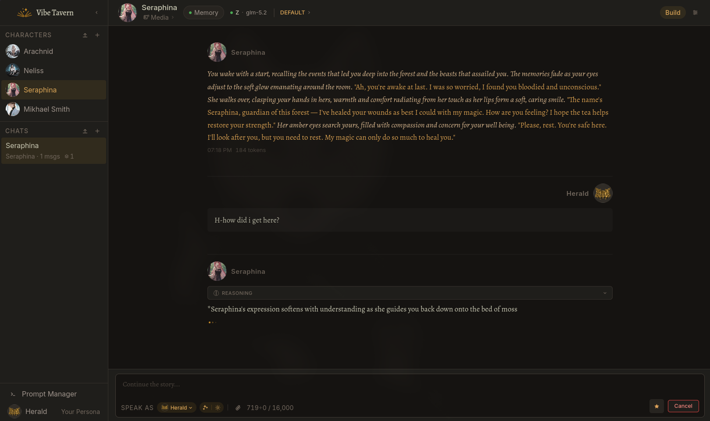

</div>

---

<a id="screenshots"></a>

<details>
<summary><h2>Screenshots</h2></summary>

<p align="center">
  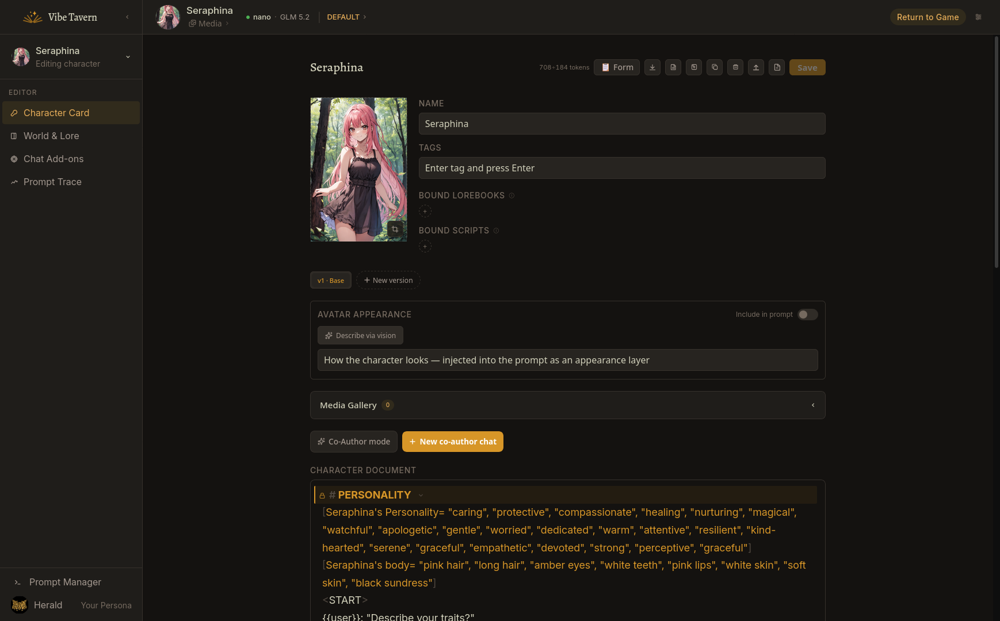
</p>

<p align="center">
  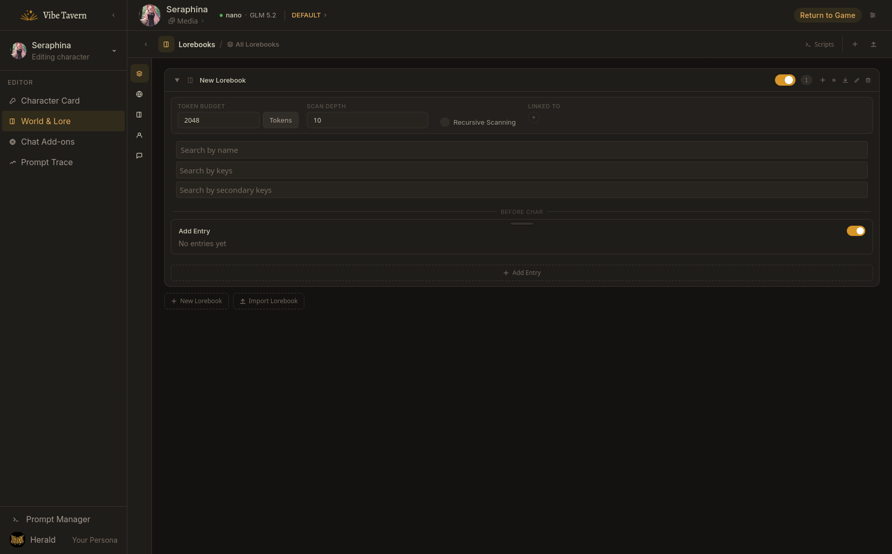
  &nbsp;&nbsp;
  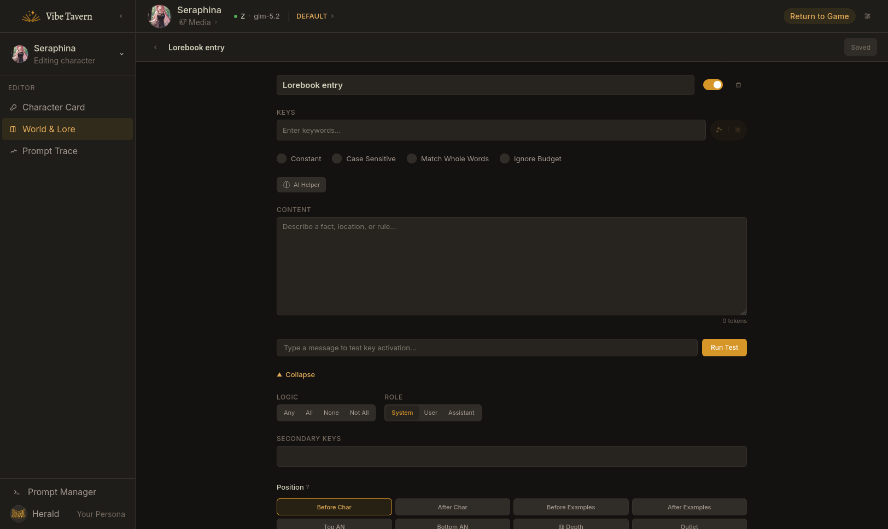
</p>

<p align="center">
  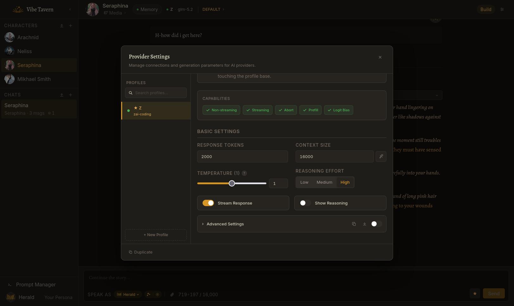
  &nbsp;&nbsp;
  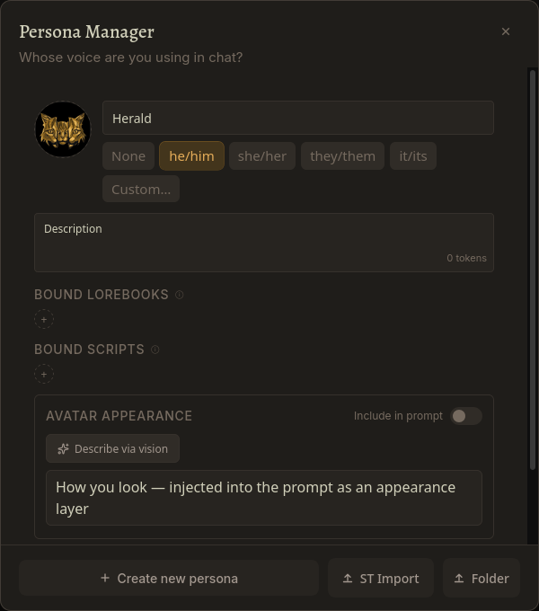
</p>

<p align="center">
  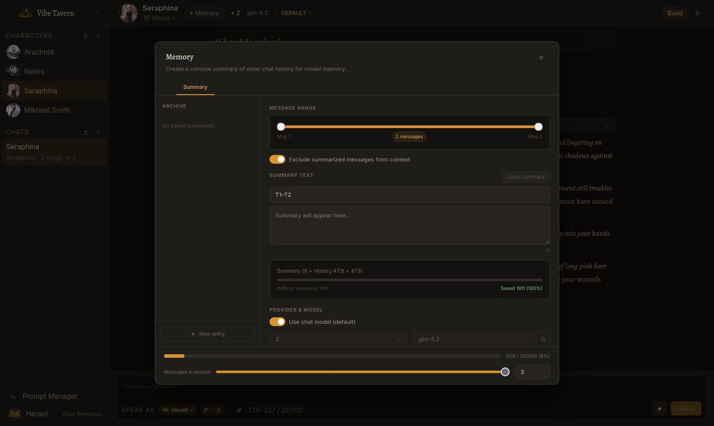
  &nbsp;&nbsp;
  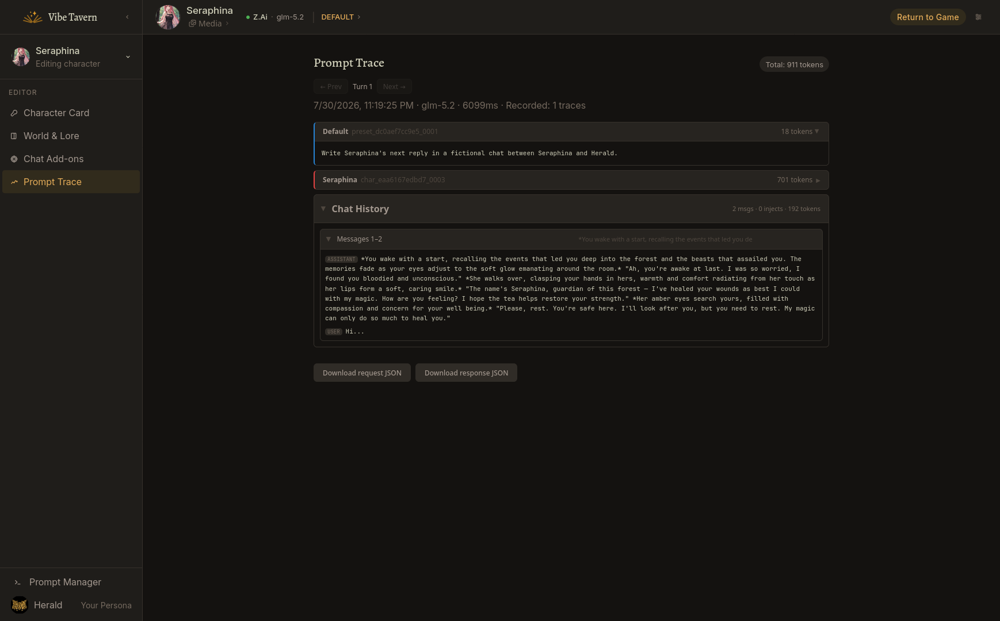
</p>

<p align="center">
  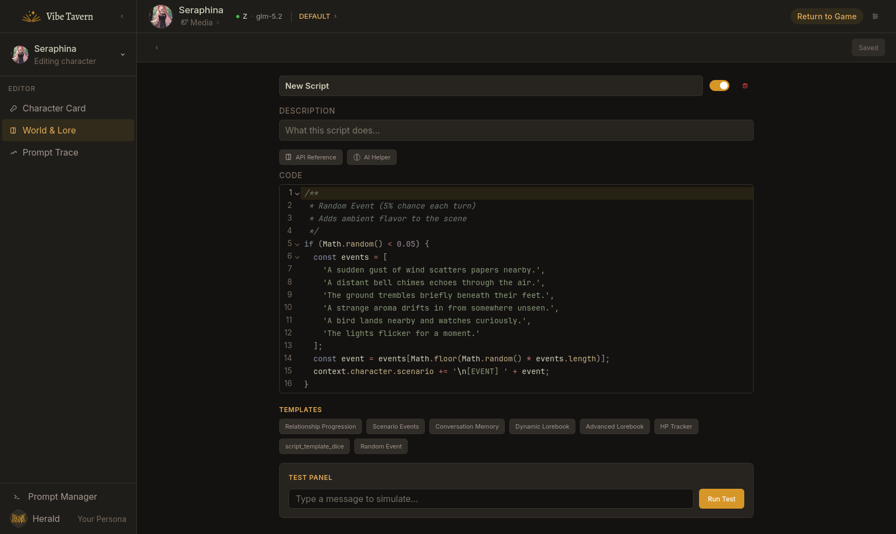
  &nbsp;&nbsp;
  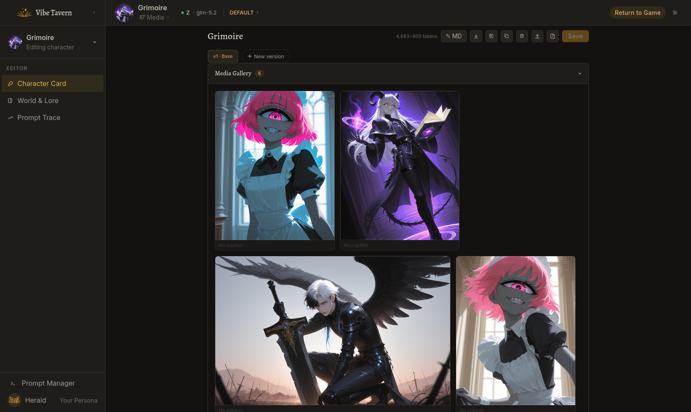
</p>

<p align="center">
  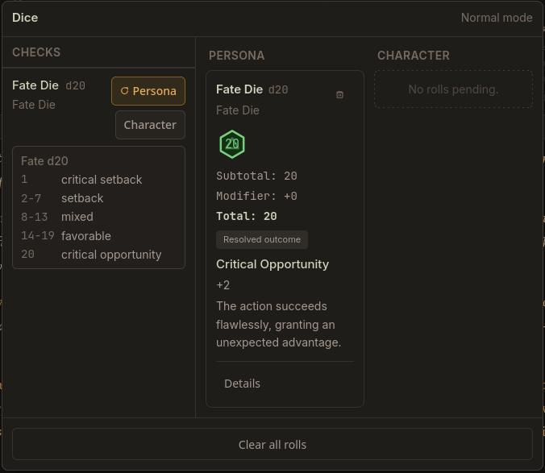
  &nbsp;&nbsp;
  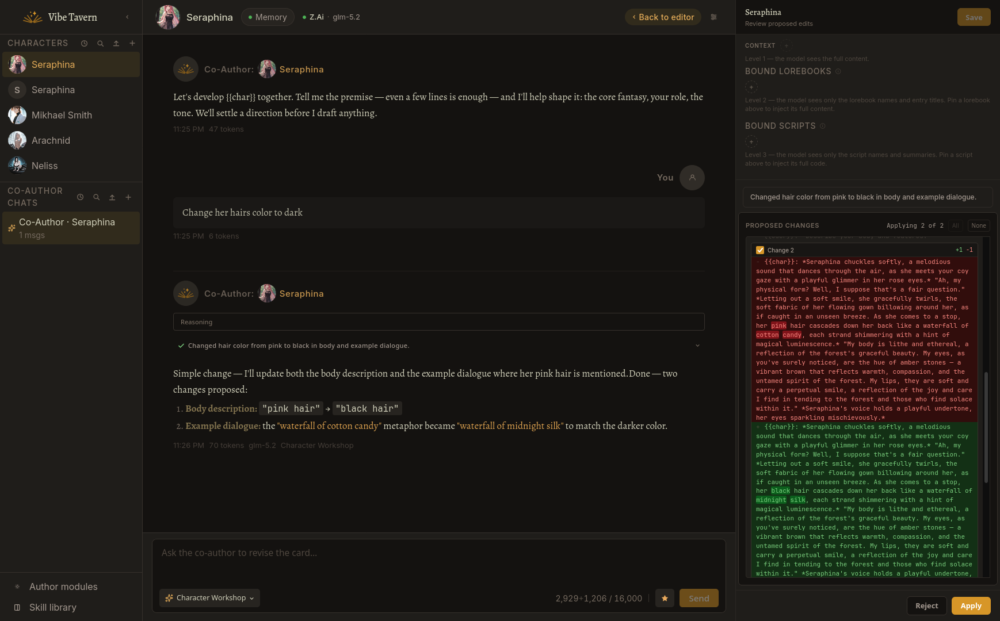
</p>

<p align="center">
  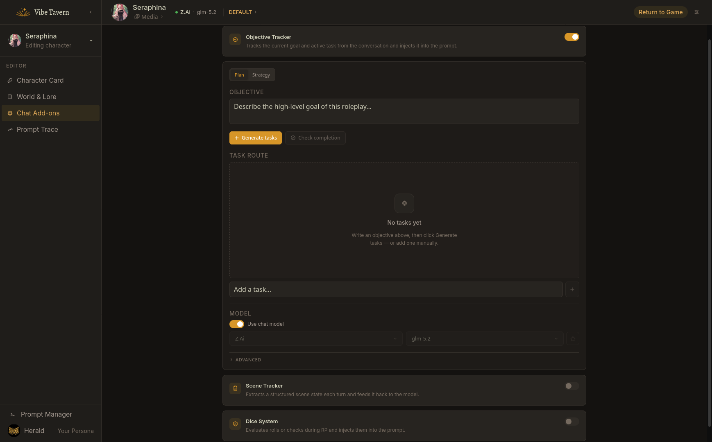
  &nbsp;&nbsp;
  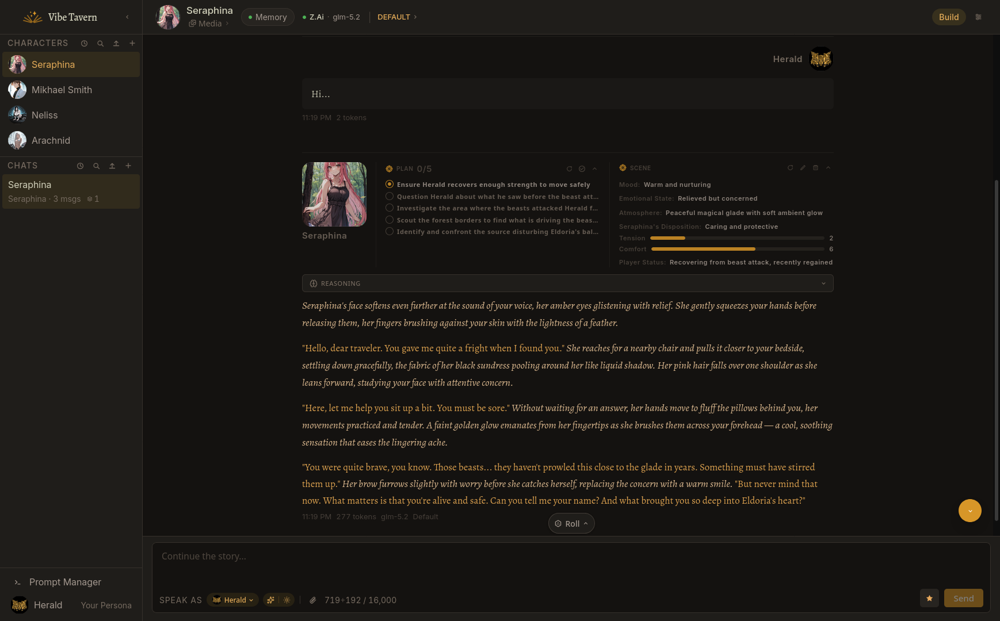
</p>

</details>

---

## What is Vibe Tavern?

Vibe Tavern is a local AI roleplay client I am building around everyday comfort, long-running sessions, and mobile screens.

I wanted routine actions to stop requiring a trip through five menus, prompt assembly to stop happening inside a black box, and character creation to become something you can actually do inside the app instead of merely importing a finished card.

You bring your own API keys, your data stays on your machine, and nearly everything important can be inspected, changed, or turned off.


> [!NOTE]
> The project in active development. Back up your data directory before updating.

---

## The short version

- **An interface made for daily use** — favorite models, personas, presets, response variants, and the context budget are available directly from chat.
- **Actual character authoring** — a structured form, a Markdown editor with pinned sections, character versions, card imports, and AI-assisted parsing of messy drafts.
- **Co-Author** — a dedicated chat where you can develop a character, load skills, and review model-proposed edits before anything is applied.
- **Prompts without the black box** — a simple mode, a visual canvas for advanced assembly, and an honest Prompt Trace of the final request.
- **Memory and game systems** — summaries, Objective Tracker, Scene Tracker, and dice rolls whose accepted results belong to a specific turn.
- **Lorebooks and JavaScript scripts** — from quick entry editing to conditional logic, random events, and persistent character state.
- **Local runtime and mobile access** — one process, your providers, QR access over your network, and a purpose-built mobile UI.

---

## A chat you can use every day

Don't want to open provider settings every time you change models? Add the ones you use to favorites and switch directly from the chat header. Personas and prompt presets are one click away in the same place.

Responses stream together with reasoning when the selected model provides it. Reasoning blocks stay collapsed by default, so they do not get in the way of reading the actual reply.

Each response can have alternatives: smooth slides on desktop, swipes on mobile. Vibe Tavern remembers which model and preset created every variant.

The composer shows how much context is already occupied. Open the breakdown to see how much was taken by history, the character, lorebooks, summaries, and every other layer.

The generation queue lets you stack requests instead of waiting for each one manually.

---

## Characters and Co-Author

Characters can be edited through a plain text or a full Markdown editor.

The Markdown editor pins the card's canonical headings so they cannot be accidentally deleted or turned into prose that prompt assembly can no longer parse reliably.

Vibe Tavern imports SillyTavern V2/V3 PNG and JSON cards, as well as Markdown. If your “card” is actually a pile of notes, prose fragments, and old dialogue, the AI assistant can try to identify the fields and show you exactly how it sorted them. If the result is weird, change the prompt target, model, or temperature and run the parse again.

Character versions let you maintain independent takes on the same card: base, more aggressive, romantic, or anything else. Each version is a complete snapshot you can switch without manually cloning the character.

Co-Author turns character editing into its own working chat. You can iteratively discuss the concept, personality, scenario, voice, and greetings; load relevant skills with templates and references; then receive proposed changes through tools. Nothing is applied silently: you see the diff first and can accept the full result or only the pieces you want.

---

## Prompts are the heart of the project

The Prompt Manager starts in simple mode: write a system prompt, choose the settings you care about, and play.

For people who want more control, advanced mode provides a visual canvas. Drag layers into an exact order, including injections at a specific history depth, while seeing character content, lorebooks, summaries, and custom prompts in the same place.

Prompt Trace does not show a pretty diagram of what the app intended to build. It shows the actual result: which layers entered the request, their final order, why a lore entry activated, and how many tokens every source consumed.

System prompt, jailbreak, prefill, author's note, summary prompt, tools prompt, and custom depth injections are all configurable. Prompt presets can be imported and exported in a SillyTavern-compatible format.

Macros such as `{{user}}`, `{{char}}`, `{{if}}`, `{{setvar}}`, `{{roll}}`, and nested blocks are handled by a real parser rather than a pile of regular-expression replacements.

---

## Memory is the brain

Choose how many recent messages the model receives, create multiple manual or AI-generated summaries, and decide separately which summaries enter context.

Automatic compaction generates summaries in the background through a model you choose and can exclude messages that have already been summarized. The interface shows how much context the full history would have consumed and how much was recovered.

Utility models do not have to match the main model. Give the heavy RP call to your favorite model and let a faster, cheaper one handle summaries and trackers.

---

## Chat Add-Ons

The Dice System — fully functional tests right in the chat. Rules are defined by dice scripts: they determine the available tests, the roll formula, modifiers, and who can roll — your character, a character, or both.
Before sending a message, select a test and roll the dice: the result will be attached to the message, appear next to it in the history, and will be transmitted to the model along with your text. Strict tests
pre-record success, failure, and mandatory consequences; narrative tests only transmit the rolled results to the model and leave the interpretation to it. In normal mode, a reroll replaces the previous result, and in immersive mode,
additional attempts are governed by script rules: you can keep the best or worst result, override the result, or select a manual attempt. A built-in Fate Die template is available for a quick start, and you can create your own
systems in the script editor.

Objective Tracker stores what the character is trying to achieve in this particular chat. A secondary model checks progress in parallel with the main RP call, and current objectives return to context so the character does not forget what it was doing in the first place.

Scene Tracker maintains structured scene state: location, participants, objects, appearance, and the other details models tend to trip over during long play. State belongs to the exact response variant that produced it and is updated by a background model without delaying the character's reply.

---

## Lorebooks

By default, the entry editor shows only what you need to get started quickly: keys and content. Full mode reveals advanced activation settings, position, depth, probability, sticky windows, cooldown, delay, recursion, and the rest of the machinery.

Entries sharing an insertion position can be reordered by dragging. Activated entries appear in Prompt Trace together with the reason each one fired.

If the blank page wins, the built-in AI assistant can write the entry and generate primary or secondary keys separately.

The engine supports AND/OR/NOT logic, probability, delay, cooldown, priority eviction, and recursive scanning where one activated piece of lore helps discover another.

Lorebooks can belong to characters, personas, or the global scope. Import and export are compatible with SillyTavern's format.

---

## JavaScript scripts

Vibe Tavern includes a JS script editor with a sandbox and a Janitor AI-compatible API. Scripts can inspect current context state, react to keywords, and add their own layers to the prompt.

The easiest way to think about them is as extremely advanced lorebook entries: when a condition appears, logic runs, state changes, or additional context is attached.

That is useful for random events, trackers, cycles, hidden mechanics, and rolls that remain fixed instead of changing on every regeneration.

You can start from built-in templates, import compatible scripts, or ask the AI assistant to write a foundation from a plain-language description.

---

## Providers and personas

Provider setup starts with three things: choose a protocol, paste the key, and test the connection. OpenAI-compatible profiles cover OpenRouter, DeepSeek, Groq, xAI, Mistral, and other compatible services; Anthropic, Google, Ollama, and llama.cpp are supported separately.

The main settings contain model selection, response size, context, and reasoning controls. Temperature, top-p, stop sequences, and other samplers stay in an advanced section where they do not bother people who do not need them.

Different models in one profile can have different sampler overlays. Favorite models stay pinned for quick switching from chat.

Each persona has a name, description, pronouns, and avatar. A vision model can optionally describe the avatar's appearance and inject that description as its own prompt layer. Personas can also have their own lorebooks.

---

## Themes, images, and mobile access

The interface includes five built-in themes: Milk Coffee, Coffee, Mystic Night, Light Lava, and Dark Lava. The set covers light, dark, restrained, and more decorative looks, all switchable from interface settings. The complete interface is available in English and Russian.

Images can be attached to chat. A vision model describes them for the main model, while the lightbox lets you inspect the original, zoom in, and edit the description when needed.

For phone access, open Mobile Access and scan the QR code. Vibe Tavern runs from the same process over your LAN or Tailscale/VPN, while remote API access is protected by a token.

The mobile version is not the desktop UI shrunk until it becomes a punishment. Small screens get their own bottom sheets, panels, carousels, and touch gestures.

An Android build for Termux automates most of the installation work.

---

## Quick start

### Windows

Download the installer from [Releases](https://github.com/Noineri/vibe_tavern/releases), run it, and install Vibe Tavern like a regular application.

If you do not want an installation, download the portable archive, extract it, and run `Vibe Tavern.exe`.

### Linux

Download the `.tar.gz` archive from [Releases](https://github.com/Noineri/vibe_tavern/releases), extract it, and run `./vibe-tavern`.

### Docker

```bash
docker compose up -d
```

### Android

Use the APK build for Termux. See the [Android setup guide](docs/android-setup.md) for details.

### Run from source

You need Git and Bun. The exact supported Bun version is pinned in the Dockerfile.

```bash
git clone https://github.com/Noineri/vibe_tavern
cd vibe_tavern
bun install --frozen-lockfile
bun run dev
```

Open the address printed by the application after startup.

---

## Data and backups

Characters, chats, settings, and assets are stored locally under `data/`. API keys are not sent to the Vibe Tavern developer — the application talks directly to the providers you configure.

Before updating, copy `data/` somewhere safe. That is enough to preserve the working state of the application.

---

## For developers

Vibe Tavern is a single-process Bun monolith: a React SPA, Hono API, and SQLite database run as one application without a separate database server.

Local setup, repository structure, and contribution rules live in [`CONTRIBUTING.md`](./CONTRIBUTING.md). Deeper documentation is available under [`docs/architecture/`](docs/architecture/).

---

## License

[AGPL-3.0](LICENSE)

---

<div align="center">

**[Download](https://github.com/Noineri/vibe_tavern/releases)** ·
**[Report a bug](https://github.com/Noineri/vibe_tavern/issues)** ·
**[Discuss](https://github.com/Noineri/vibe_tavern/discussions)**

Built by AI agents on pure vibes ✨

</div>
